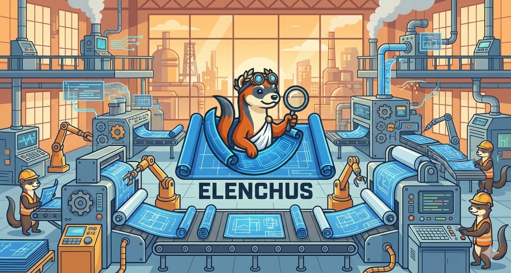

# Elenchus

<p align="center">
  
</p>

<p align="center">
  <strong>Transform epics into agent-ready specifications through Socratic interrogation</strong>
</p>

> **Elenchus** (ἔλεγχος): The Socratic method of eliciting truth by question and answer.

Transform high-level epics into precise, agent-ready specifications through **interrogative specification**. Elenchus is a **specification engine**, not an execution engine—it prepares the plan, external orchestrators (like Claude Flow) execute it.

## The Problem

79-87% of AI coding agent failures are specification problems, not technical ones. Agents fail because they're given vague requirements and expected to read minds.

Current approaches fail because:
- **Over-specification** defeats agent creativity and becomes outdated immediately
- **Under-specification** leads to constant clarification loops and wasted cycles
- **Static specs** diverge from dynamic codebases

## The Solution

Elenchus uses a **hybrid approach**:

1. **Thin spec upfront**: Capture intent and constraints, not implementation details
2. **Socratic interrogation**: Generate targeted clarifying questions to surface ambiguity
3. **Checkpoint validation**: Human-in-the-loop approval at critical decision points
4. **Context-aware generation**: Analyze your codebase to generate specs that fit

## Installation

```bash
# Clone the repository
git clone https://github.com/evanvolgas/elenchus.git
cd elenchus

# Install dependencies
npm install

# Build
npm run build
```

## Setup

### API Key Configuration

Elenchus uses Claude AI for LLM-powered question generation and answer validation. Configure your Anthropic API key using one of these methods (in order of precedence):

#### Option 1: Environment Variable (Recommended for CI/CD)

```bash
export ANTHROPIC_API_KEY=sk-ant-api03-your-key-here
```

#### Option 2: Configuration File (Recommended for Local Development)

Copy the example config and add your key:

```bash
cp elenchus.config.example.json elenchus.config.json
```

Then edit `elenchus.config.json`:

```json
{
  "anthropicApiKey": "sk-ant-api03-your-key-here"
}
```

> **Security**: `elenchus.config.json` is automatically gitignored. Never commit API keys to version control.

#### Option 3: .env File

If you use a `.env` file for other services, Elenchus will read `ANTHROPIC_API_KEY` from it when no config file is present.

#### Without an API Key

Elenchus works without an API key using template-based interrogation. LLM-powered features (semantic question generation, answer validation, challenge mode) require a valid API key.

### Claude Code

```bash
claude mcp add elenchus -- node /path/to/elenchus/dist/index.js
```

### Cursor

Add to `.cursor/mcp.json`:

```json
{
  "mcpServers": {
    "elenchus": {
      "command": "node",
      "args": ["/path/to/elenchus/dist/index.js"]
    }
  }
}
```

### Verify Installation

Restart your editor and check that Elenchus tools are available. In Claude Code, you can ask:

> "What Elenchus tools are available?"

## Quick Start

### 1. Ingest an Epic

```
Use elenchus_ingest to process this epic:

"Build a REST API for managing a book library. Users should be able to:
- Add, update, and delete books
- Search books by title, author, or ISBN
- Track which books are checked out and by whom

Technical requirements:
- Use Express and TypeScript
- Store data in SQLite
- Include authentication for librarians"
```

### 2. Analyze Your Codebase (Optional)

```
Use elenchus_analyze to understand my codebase at /path/to/project
```

This detects:
- Codebase maturity (greenfield, early, established, legacy)
- Architecture patterns (monolith, microservices, serverless)
- Existing conventions (naming, file structure, testing)
- Relevant files for your epic

### 3. Start Interrogation

```
Use elenchus_interrogate to generate clarifying questions for my epic
```

Elenchus generates prioritized questions like:
- **Critical**: "What are the acceptance criteria for the search feature?"
- **Important**: "Should authentication use JWT or sessions?"
- **Nice-to-have**: "What's the expected timeline for this POC?"

### 4. Answer Questions

```
Use elenchus_answer to respond:
- Question about search: "Users should be able to search by partial title match, exact author name, or ISBN. Results should return within 200ms."
- Question about auth: "Use JWT with 24-hour expiration"
```

Repeat until clarity score reaches 70%+.

### 5. Generate Specification

```
Use elenchus_generate_spec to create the agent-ready specification
```

Outputs in your choice of format (default: markdown for token efficiency):
- **Markdown**: Human-readable for review (default)
- **YAML**: Machine-readable for agent consumption
- **JSON**: Structured task graph for orchestration

Use `format: 'all'` to get all formats, or `includeRawSpec: true` for the full spec object.

### 6. Validate Specification

```
Use elenchus_validate to check the spec is complete and ready for execution
```

The generated specification is now ready to hand off to an execution orchestrator.

## Executing Specifications

**Elenchus generates the plan, but doesn't execute it.** Once you have a validated specification, hand it off to an execution orchestrator.

### Recommended: Claude Flow

Claude Flow is the recommended orchestrator for executing Elenchus specifications. It provides:

- Multi-agent swarm coordination
- Checkpoint-based execution with human approval gates
- Background worker system for continuous optimization
- Memory persistence across sessions

**Installation**:

```bash
# Add Claude Flow MCP server
claude mcp add claude-flow -- npx -y @claude-flow/cli@latest

# Verify installation
npx @claude-flow/cli@latest doctor
```

**Basic usage after spec generation**:

```bash
# Initialize swarm with anti-drift topology
npx @claude-flow/cli@latest swarm init --topology hierarchical --max-agents 8

# Spawn agents based on spec phases
# (Or use Claude Code Task tool to spawn agents concurrently)
```

Learn more: [Claude Flow on GitHub](https://github.com/ruvnet/claude-flow)

### Alternative: Claude Code Task Tool

You can also use Claude Code's built-in Task tool to spawn agents directly based on the generated specification.

## MCP Tools Reference

| Tool | Description |
|------|-------------|
| `elenchus_ingest` | Parse epics from text, JIRA, Notion, GitHub, or Linear |
| `elenchus_analyze` | Analyze codebase context, patterns, and conventions |
| `elenchus_interrogate` | Generate Socratic clarifying questions |
| `elenchus_answer` | Process answers and update session |
| `elenchus_generate_spec` | Create agent-ready specification (handoff point) |
| `elenchus_validate` | Validate spec completeness and readiness |
| `elenchus_status` | Check status of epics, sessions, or specs |
| `elenchus_health` | Server health check with storage connectivity and metrics |

## Workflow Diagram

```
┌─────────────────────────────────────────────────────────────────┐
│                     ELENCHUS (Specification)                    │
├─────────────────────────────────────────────────────────────────┤
│                                                                 │
│  ┌─────────────┐   ┌─────────────┐   ┌─────────────┐          │
│  │   INGEST    │──▶│   ANALYZE   │──▶│ INTERROGATE │          │
│  │   Epic      │   │  Codebase   │   │  Questions  │          │
│  └─────────────┘   └─────────────┘   └──────┬──────┘          │
│                                              │                  │
│                   ┌──────────────────────────┘                  │
│                   │                                             │
│                   ▼                                             │
│           ┌─────────────┐   ┌─────────────┐   ┌─────────────┐ │
│           │   ANSWER    │──▶│  GENERATE   │──▶│  VALIDATE   │ │
│           │  Questions  │   │    Spec     │   │    Spec     │ │
│           └─────────────┘   └─────────────┘   └──────┬──────┘ │
│                                                       │         │
└───────────────────────────────────────────────────────┼─────────┘
                                                        │
                                      Handoff: Agent-Ready Spec
                                                        │
┌───────────────────────────────────────────────────────┼─────────┐
│              EXTERNAL ORCHESTRATOR (Execution)        │         │
│                    (Claude Flow recommended)          │         │
├───────────────────────────────────────────────────────┼─────────┤
│                                                       ▼         │
│                                              ┌─────────────┐    │
│                                              │   EXECUTE   │    │
│                                              │    Swarm    │    │
│                                              └──────┬──────┘    │
│                                                     │           │
│                                                     ▼           │
│                                              ┌─────────────┐    │
│                                              │   DELIVER   │    │
│                                              │    POC      │    │
│                                              └─────────────┘    │
└─────────────────────────────────────────────────────────────────┘
```

## Example Session

```typescript
// 1. Ingest epic
const epic = await elenchus_ingest({
  source: 'text',
  content: 'Build a todo app with user authentication...'
});
// Returns: { epic: { id: 'epic-abc123', ... }, extractionConfidence: 75 }

// 2. Analyze codebase
const context = await elenchus_analyze({
  path: '.',
  epicId: epic.epic.id
});
// Returns: { maturity: 'established', architecture: 'monolith', ... }

// 3. Start interrogation
const session = await elenchus_interrogate({
  epicId: epic.epic.id
});
// Returns: { session: {...}, nextQuestions: [...], readyForSpec: false }

// 4. Answer questions
await elenchus_answer({
  sessionId: session.session.id,
  questionId: 'q-scope-goals-1',
  answer: 'Users should be able to create, complete, and delete todos'
});

// 5. Generate spec when ready
const spec = await elenchus_generate_spec({
  sessionId: session.session.id
});
// Returns: { summary: {...}, markdown: '...' }
// Use format: 'all' and includeRawSpec: true for full output
```

## Specification Output

Generated specs include:

### Business Context
- Problem statement
- User persona
- Success metrics
- Out of scope items

### Technical Context
- Codebase analysis results
- Constraints and requirements
- Integration points

### Execution Plan
- Phased approach (Research → Architecture → Implementation → Testing → Review)
- Task breakdown with agent assignments
- Checkpoint gates for human approval

### Validation
- Acceptance criteria (Given/When/Then format)
- Test strategy
- Risk assessment

### Estimates
- Token usage estimates
- Cost estimates (by phase)
- Duration estimates

## Interrogation Engine V2 Features

With an Anthropic API key configured, Elenchus unlocks advanced LLM-powered features:

### LLM-Powered Question Generation
- **Context-aware questions**: Questions tailored to your epic's domain and codebase
- **Semantic gap detection**: Identifies missing information based on content analysis
- **Tech stack awareness**: Questions specific to detected technologies

### Answer Validation
- **Vagueness detection**: Flags answers containing "stuff", "things", "maybe", etc.
- **Completeness checks**: Ensures answers fully address the question
- **Contradiction detection**: Identifies conflicts between different answers

### Multi-Round Progression
- **Adaptive questioning**: Follow-up questions based on previous answers
- **80% clarity escape**: Can proceed to spec generation when understanding is sufficient
- **10-round maximum**: "Ralph Wiggum" termination prevents infinite loops

### Challenge Mode (Opt-in)
Enable with `challengeMode: true` in interrogation:
- **Devil's advocate questions**: "What if this fails at 10x scale?"
- **Assumption surfacing**: "Are you assuming all users have accounts?"
- **Alternative exploration**: "Have you considered GraphQL instead of REST?"

## Question Types

Elenchus generates questions in six categories:

| Type | Purpose | Example |
|------|---------|---------|
| **Scope** | Define boundaries | "What is explicitly OUT of scope?" |
| **Constraint** | Surface requirements | "Are there performance requirements?" |
| **Success** | Define done | "How will we validate this works?" |
| **Technical** | Guide decisions | "Should we use REST or GraphQL?" |
| **Risk** | Identify concerns | "What could go wrong?" |
| **Clarification** | Remove ambiguity | "When you say 'users', do you mean...?" |

## Codebase Maturity Detection

Elenchus adapts to your codebase:

| Maturity | Signals | Approach |
|----------|---------|----------|
| **Greenfield** | No files | Maximum flexibility, establish conventions |
| **Early** | Few files, no tests | Suggest patterns, add testing |
| **Established** | Tests, CI, TypeScript | Follow existing conventions |
| **Legacy** | Large, mixed patterns | Careful integration, risk assessment |

## Architecture

```
elenchus/
├── src/
│   ├── index.ts           # Entry point
│   ├── server.ts          # MCP server
│   ├── tools/             # MCP tool implementations
│   │   ├── ingest.ts
│   │   ├── analyze.ts
│   │   ├── interrogate.ts
│   │   ├── answer.ts
│   │   ├── generate-spec.ts
│   │   ├── validate.ts
│   │   ├── status.ts
│   │   └── health.ts
│   ├── resources/         # MCP resources
│   ├── storage/           # SQLite persistence
│   ├── types/             # TypeScript definitions
│   └── utils/             # Helpers
├── tests/                 # Test files
├── dist/                  # Compiled output
└── package.json
```

## Development

```bash
# Run in development mode
npm run dev

# Type check
npm run typecheck

# Build
npm run build

# Run tests
npm test

# Lint
npm run lint
```

## Roadmap

### MVP (Current)
- [x] Epic ingestion (text)
- [x] Codebase analysis
- [x] Socratic interrogation
- [x] Spec generation (YAML/Markdown/JSON)
- [x] Validation

### Next
- [ ] Checkpoint feedback loop (record execution results)
- [ ] JIRA/Notion/GitHub integrations for epic ingestion
- [ ] Multi-epic session support
- [ ] Spec refinement based on execution feedback

### Future
- [ ] Multi-user collaborative sessions
- [ ] Cost tracking and optimization recommendations
- [ ] Spec versioning and diff
- [ ] Learning from execution outcomes to improve future interrogations

## Philosophy

1. **Interrogation over Specification**: Ask questions, don't assume answers
2. **Separation of Concerns**: Specification (Elenchus) and execution (external orchestrators) are distinct
3. **Adaptation over Prescription**: Detect codebase context, don't force patterns
4. **Transparency over Magic**: Show reasoning, decisions, and tradeoffs
5. **Checkpoints over Autonomy**: Humans approve at critical gates (during execution)

## Why "Elenchus"?

In ancient Greek philosophy, *elenchus* (ἔλεγχος) refers to the Socratic method of inquiry—a form of cooperative argumentative dialogue that uses questioning to stimulate critical thinking and illuminate ideas.

Just as Socrates used questions to help others discover truth, Elenchus uses targeted interrogation to transform vague epics into precise, executable specifications.

## License

MIT

## Contributing

Contributions welcome! Please read the architecture documentation in `ARCHITECTURE.md` before submitting PRs.
